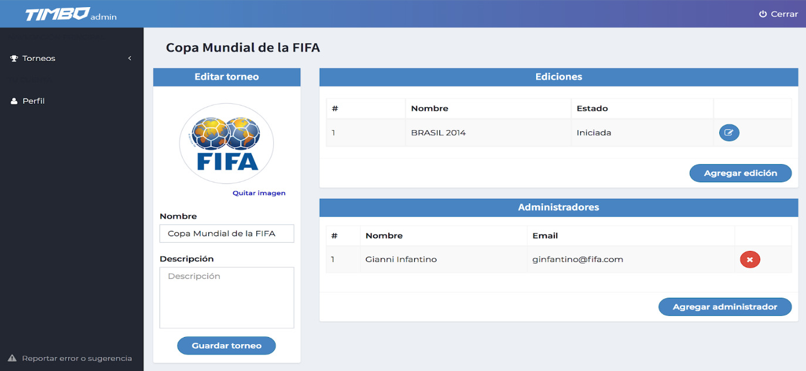

# Primeros pasos

## Ingreso al administrador de torneo

Accedemos al administrador de torneos ingresando a www.timboapp.com/admin . En la pantalla nos pedirá que indiquemos el correo electrónico de nuestra cuenta y la contraseña.

## Pantalla principal

### Torneos

Este menú nos despliega todos los torneos a los que esté asociada nuestra cuenta. Clickeando en uno de ellos ingresamos a la siguiente pantalla:

- <strong>Editar torneo:</strong> nos permite agregar un logo/foto de perfil de nuestro torneo, editar el nombre y agregar una descripción. Una vez finalizado clickeamos en “Guardar torneo”.
- <strong>Ediciones:</strong> muestra las diferentes ediciones del torneo a lo largo del tiempo (Ej: Sudáfrica 2010, Brasil 2014, Rusia 2018). Clickeando en “Agregar edición” nos permite crear una nueva.
- <strong>Administradores:</strong> muestra un listado con todas las cuentas que tienen acceso a editar todos los aspectos globales del torneo. Clickeando en “agregar administrador” podemos añadir nuevos.

### Perfil

Muestra los datos básicos de la cuenta.

