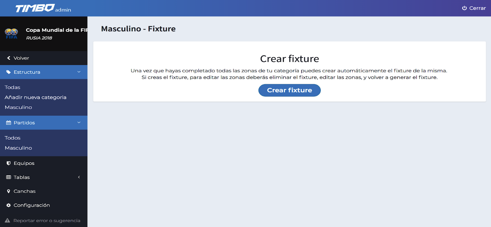
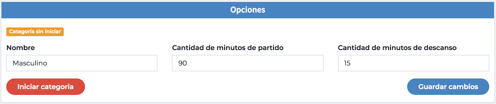
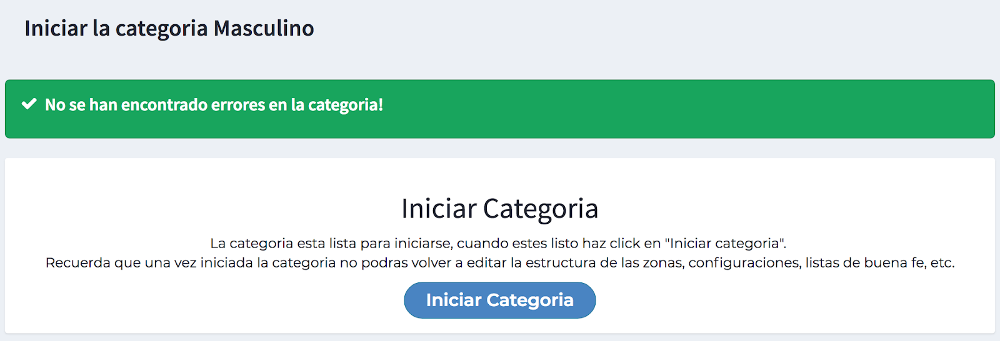

# Crear Fixture e Iniciar Categoría

Ya creamos la edición, agregamos la categoría, definimos su estructura, los equipos de las zonas de etapa 1 y las canchas. El paso siguiente es crear el Fixture. 

<strong>TIMBO dispone de una herramienta que crea automáticamente todas las fechas que deben disputarse. No debemos preocuparnos, ya que posteriormente el sistema nos permitirá hacer las modificaciones que sean necesarias.</strong>

Para crearlo debemos ingresar al menú “Partidos” y clickeamos en la categoría correspondiente. Luego simplemente debemos clickear en el boton <strong>“Crear fixture”</strong> y, si el sistema no detecta ningún error, ya tendremos nuestro fixture creado.

Con el Fixture creado, podemos proceder a <strong>“Iniciar Categoria”</strong>, volviendo al apartado “Estructura”.

En caso de que no haya ningún error nos aparecerá este mensaje. A continuación hacemos click en <strong>“Iniciar Categoria”</strong>.

Con esto finalizamos el armado del torneo. Ahora podemos iniciar la carga de los resultados de los partidos que se vayan disputando.