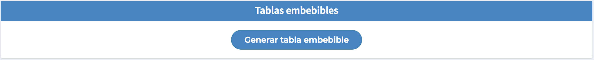

# Configuración

En el apartado de “Configuración” podremos modificar datos básicos del torneo configurados inicialmente. Hay ciertos datos que ya no podremos modificar (los que campos en gris).

## Tablas embebibles

En caso de que tengamos una página web del torneo y deseemos agregar las tablas a la misma, solo tenemos que pasarle al programador de la página web el código que Timbo provee.

## Terminar edición y Borrar edición

En la parte baja de “Configuración” tenemos dos funciones en cuanto a la edición que se está disputando o a disputarse.

- <strong>Terminar edición:</strong> luego de haberse jugado todos los partidos de la edición del torneo estamos en condiciones de terminar la misma cerrando su ciclo.
- <strong>Borrar edición:</strong> en caso de que no llegara a disputarse la edición existe la posibilidad de borrar la misma.