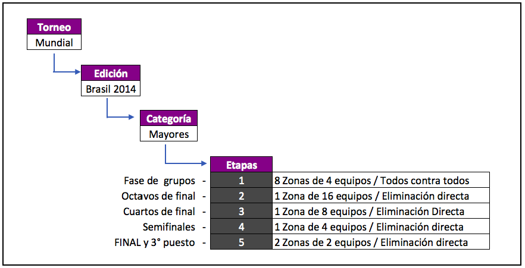
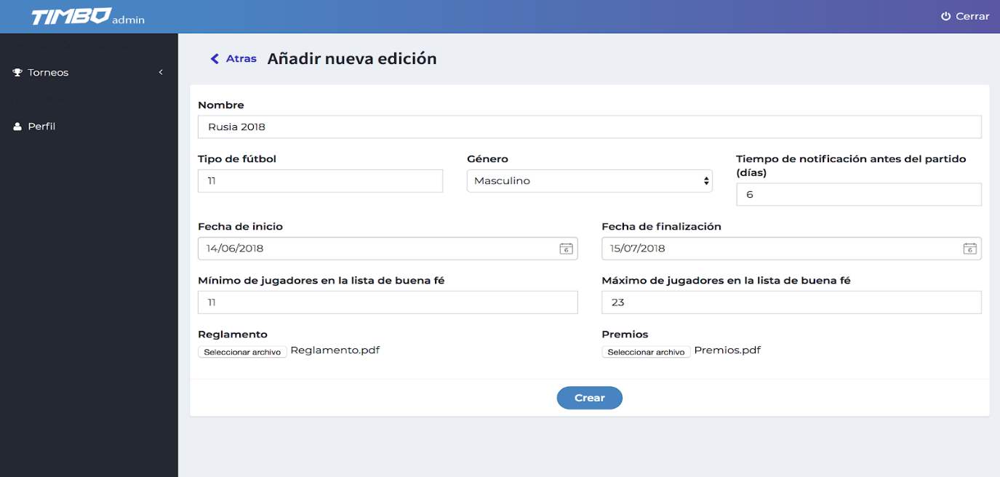
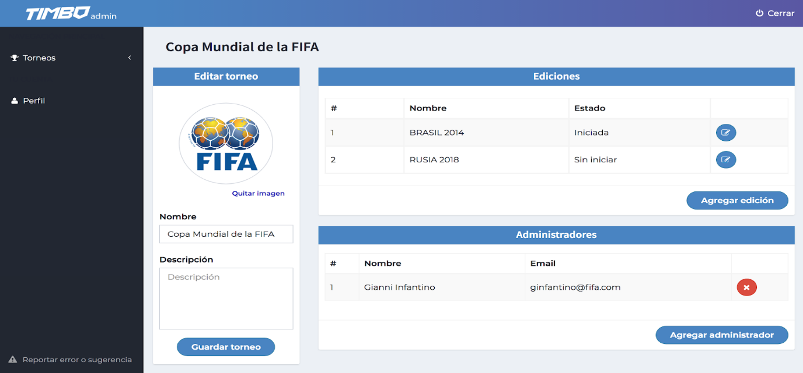
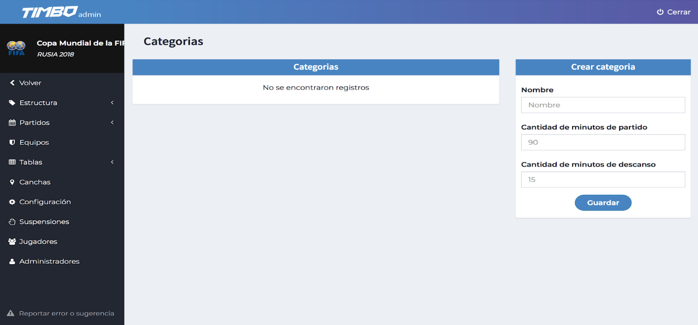
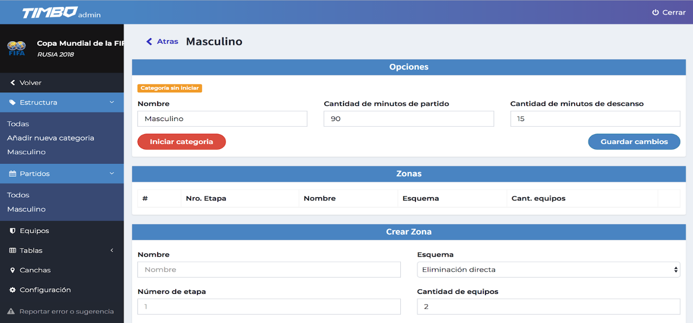
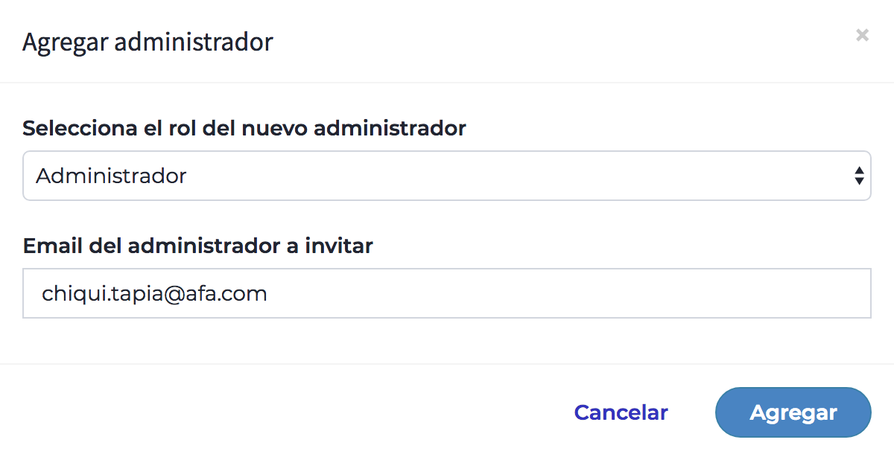
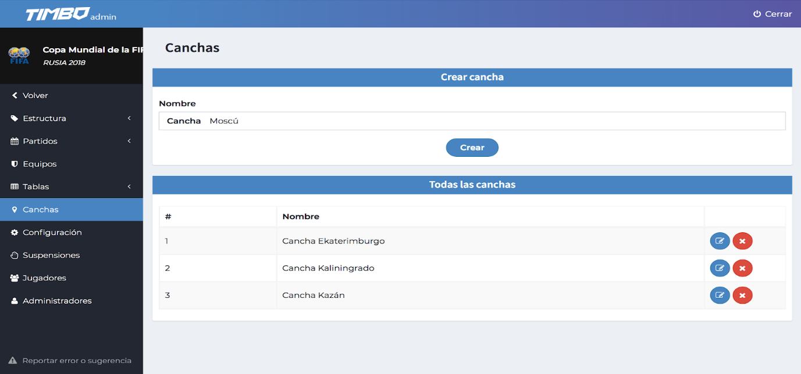

# Estructura del torneo

Aquí es donde empezamos a darle forma a la estructura del torneo. Para esto tenemos que  tener presentes los siguientes conceptos.

- <strong>Torneo:</strong> es el perfil  del torneo que estamos gestionando (ej: Copa Mundial de la FIFA)
- <strong>Ediciones:</strong> una edición nos permite agrupar todos los partidos que se juegan en un periodo de tiempo determinado (ej: Brasil 2014, Rusia 2018, Apertura 2017, Clausura 2018)
- <strong>Categorias:</strong> son las diferentes divisiones pertenecientes a cada edición como así también la separación entre fútbol masculino y femenino (ej: Primera A, Primera B, Varones A, Mujeres A, etc)
- <strong>Zonas:</strong> son aquellas en donde van a estar incluídos los equipos que se van a enfrentar para ir avanzando de Etapas (ej: Grupo A, Grupo B, Grupo C)
- <strong>Etapas:</strong> son los diferentes niveles de avance en el Torneo (ej: Cuartos de Final, Semifinales, Final)

En cuanto a las formas en que se pueden enfrentar los equipos encontramos:

- <strong>Eliminación directa:</strong> es aquella en la cual en un sólo partido avanza a la siguiente ronda el equipo vencedor (estilo Copa Mundial)
- <strong>Eliminación ida y vuelta:</strong> es aquella en donde se juegan dos partidos para determinar un vencedor mediante el resultado global de ambos (estilo Champions League, Copa Libertadores)
- <strong>Todos contra todos:</strong> es aquel formato en el que se enfrentan todos los equipos pertenecientes a la misma Zona sumando puntos por resultados conseguidos (estilo fase de Grupos de la Copa Mundial, Torneo Apertura Argentino)
- <strong>Todos contra todos ida y vuelta:</strong> es aquel formato en el que se enfrentan todos los equipos tanto en ida como en vuelta sumando puntos por resultados obtenidos (estilo fase de Grupos de Champions League, fase de Grupos de Copa Libertadores; Liga Española, Italiana, Inglesa, etc)

## Añadir una nueva edición

Clickeando en “Añadir edición” en la pantalla principal, accedemos al menú de configuración general de la nueva edición. También tenemos la posibilidad de cargar un archivo con el Reglamento y el sistema de Premios, a los que luego tendrán acceso los jugadores.
Una vez finalizada la configuración, hacemos click en <strong>“Crear”</strong>

Para ingresar a la nueva edición clickeamos en el respectivo ícono sobre el margen derecho (el que tiene el lápiz).

Luego de ingresar, en el margen izquierdo de la pantalla, nos encontramos con una barra en la que se encuentran todas las herramientas para que puedas gestionar con eficiencia tu torneo. No te preocupes que vamos a ir explicando cada una de ellas a lo largo del instructivo.

## Añadir una  nueva categoría

En el menú “Estructura” podemos añadir las  divisiones o categorías indicando la duración de los partidos y de los descansos.

- <strong>Cantidad de minutos de partido:</strong> aquí agregamos la suma de los dos tiempos del partido. En caso de que cada tiempo tenga 45 minutos, corresponderá 90 minutos de partido.
- <strong>Cantidad de minutos de descanso:</strong> aquí incluimos los minutos de descanso entre ambos tiempos del partido.

## Crear etapas y zonas

Una vez creada la categoría debemos estructurarla. Para ello es que se crean las diferentes zonas, las cuales determinan el esquema de cada etapa del torneo. 

Para ingresar desplegamos el menú “Estructura” y clickeamos sobre la correspondiente categoría.

- <strong>Opciones:</strong> detalla los datos básicos de la categoría, con la posibilidad de modificarlos.
- <strong>Zonas:</strong> se listan todas las zonas que ya hemos creado. indicando su correspondiente etapa.
- <strong>Crear Zona:</strong> aquí es donde podemos agregar una nueva zona a nuestra categoría. Solo debemos indicar su nombre, su esquema, a qué etapa corresponde y la cantidad de equipos que deseamos.

### Ejemplo Copa Mundial de la FIFA

A continuación veremos un ejemplo de cómo se estructuraría la Copa Mundial de la FIFA.

#### Fase de Grupos (Etapa 1)

En este caso creamos las Zonas pertenecientes a la Fase de Grupos: Grupo A, B, C, D, E, F, G y H

<strong>Nota:</strong> La asignación de los Equipos a la primer Etapa la veremos en el punto 3.4

#### Octavos de Final (Etapa 2)

Aquí vamos a crear una Zona para incluir todos los partidos de Octavos de Final (8 partidos)

Para asignar los equipos que jugarán esta instancia seleccionamos <strong>“Resultado”</strong> y elegimos a los equipos de acuerdo al resultado de la Etapa anterior. Al finalizar <strong>“Guardar cambios”</strong>

#### Cuartos de Final (Etapa 3)

Aquí vamos a crear una Zona para incluir todos los partidos de Cuartos de Final (4 partidos)

Para asignar los equipos que jugarán esta instancia seleccionamos <strong>“Resultado”</strong> y elegimos a los equipos de acuerdo al resultado de la Etapa anterior. Al finalizar <strong>“Guardar cambios”</strong>

#### Semifinal (Etapa 4)

Aquí vamos a crear una Zona para incluir todos los partidos de Semifinal (2 partidos)

Para asignar los equipos que jugarán esta instancia seleccionamos <strong>“Resultado”</strong> y elegimos a los equipos de acuerdo al resultado de la Etapa anterior. Al finalizar <strong>“Guardar cambios”</strong>

#### Final y 3er Puesto (Etapa 5)

Aquí vamos a crear una Zona para incluir todos los partidos de Final y 3º Puesto (2 partidos). O bien, podemos crear una Zona para cada partido (ambas como Etapa 5)

Para asignar los equipos que jugarán esta instancia seleccionamos <strong>“Resultado”</strong> y elegimos a los equipos de acuerdo al resultado de la Etapa anterior. Al finalizar <strong>“Guardar cambios”</strong>

Para asignar los equipos que jugarán esta instancia seleccionamos <strong>“Resultado”</strong> y elegimos a los equipos de acuerdo al resultado de la Etapa anterior. Al finalizar <strong>“Guardar cambios”</strong>

## Administradores de ediciones

Los administradores son aquellos usuarios que habilitamos para que nos ayuden con la gestión del torneo. Ingresando al menú “Administradores” podemos añadirlos haciendo click en el botón <strong>“Agregar Administrador”</strong>.

- <strong>Rol del Administrador:</strong> el nivel de acceso al sistema que va a tener el invitado va a depender del rol que le asignemos:
	- <strong>Fichero:</strong> es el planillero que va a poder completar los datos de los partidos sin poder cerrarlos.
	- <strong>Administrador:</strong> va a tener acceso a todos los apartados de la edición del Torneo.
- <strong>Email del administrador:</strong> es necesario ingresar el mail del administrador para enviar la invitación.

## Canchas

En el apartado “Canchas” podrás dar de alta la cantidad de canchas que dispone el torneo para los partidos (será importante luego para la distribución de canchas en las distintas fechas).

