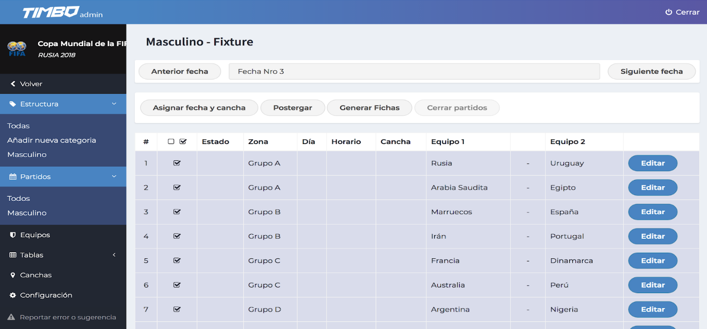

# Gestión del fixture

## Asignación de fechas: día, horario y cancha

Para comenzar con la asignación de días, horarios y canchas vamos a ingresar en el menú “Partidos” de la categoría en cuestión. Tenemos dos maneras de editar los datos básicos de un partido. Podemos ingresar para editarlos manualmente, o disponemos de una herramienta que nos facilita el trabajo permitiendo asignación por lotes. Para ello vamos a tildar los partidos a los que queramos realizar la asignación y clickeamos en <strong>“Asignar fecha y cancha”</strong>.

Dentro del menú de asignación tendremos las siguientes opciones:

- <strong>Día de inicio:</strong> es la fecha calendario en la que va a iniciar la Fecha nro. X del campeonato.
- <strong>Días:</strong> son los días de la semana en los que se va a jugar la Fecha.
- <strong>Horario de inicio:</strong> es el horario en el que se juega el primer partido.
- <strong>Horario de fin:</strong> es el horario en que finaliza el último partido.
- <strong>Mins. entre partidos:</strong> son los minutos de tiempo muerto entre un partido y el siguiente.

<strong>Ejemplo:</strong> suponiendo que los partidos se juegan cada 2 horas, teniendo 2 tiempos de 45 minutos cada uno y 15 minutos de descanso, tendremos 15 minutos entre partidos:

45’ + 45’ + 15’ + 15’ = 120’	(2 horas)

- <strong>Canchas:</strong> son las canchas que van a ser asignadas al lote de partidos que seleccionamos. En caso de usar todas tildamos “Usar todas las canchas”, caso contrario destildar la opción y elegir las las canchas deseadas.
- <strong>Asignar canchas aleatoriamente:</strong> esta opción sirve para que los equipos jueguen en canchas y horarios diferentes cada fecha.

Una vez completados los datos requeridos nos van a aparecer las diferentes asignaciones de Horarios y Canchas. Los mismos luego se pueden modificar en la edición de los partidos.

En cuanto al Estado de los Partidos vamos a tener los siguientes:

- <strong>Preparado:</strong> la fecha de inicio es posterior a la actual. Debemos esperar a que inicie el partido para poder cargar los datos del mismo.
- <strong>Jugándose:</strong> el partido se está disputando. En esta instancia los planilleros podrán comenzar con la carga de resultados.
- <strong>Terminado:</strong> el partido ya ha finalizado. Podemos seguir editando los datos.
- <strong>Cerrado:</strong> ya han sido chequeados los datos del Partido. En esta instancia ya no es posible seguir editando los datos. El perfil de “Dueño” es el único autorizado para cerrar o reabrir los partidos.

## Postergar Partidos

Ante la imposibilidad de jugar determinado partido tenemos la posibilidad de postergarlo para que se jueguen en un futuro. Para ello seleccionamos el o los partidos en cuestión y clickeamos en <strong>“Postergar”</strong>

En esta sección vamos a poder elegir la cantidad de días en los que se posterga el partido o bien postergarlo indefinidamente.

## Generar Fichas y Cerrar partidos

- <strong>Generar fichas:</strong> una función interesante de Timbo es que nos permite generar e imprimir las fichas del partido para que los ficheros completen los datos necesarios para luego cargarlos al sistema (presentismo, goles, tarjetas, suspensiones, etc).
- <strong>Cerrar partidos:</strong> una vez cargados los datos y resultados de los partidos podremos cerrar los partidos para que impacten en las tablas (posiciones, goleadores, tarjetas).
