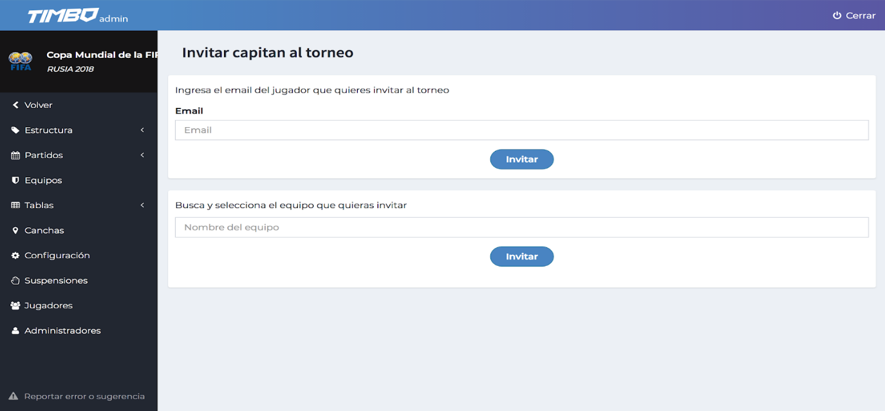
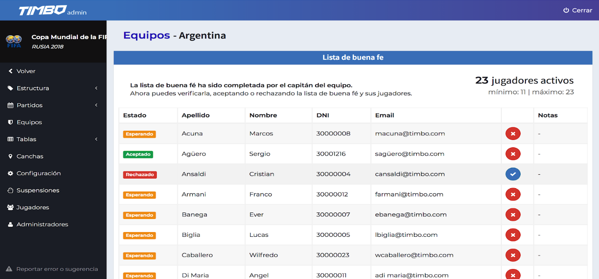
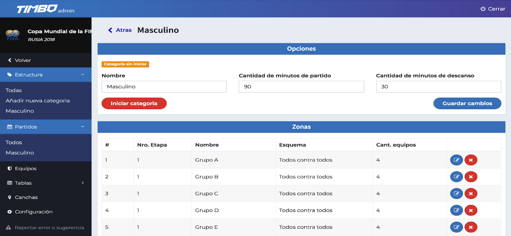

# Gestión de equipos

## Equipos

Ya estructuramos nuestra categoría. Es momento de agregar los equipos que van a competir en ella. Ingresando al menú “Equipos” nos encontraremos con la siguiente pantalla:

### Invitación de equipos

Clickeando en <strong>“Invitar equipos”</strong> accedemos a una herramienta que nos permite enviar invitación al capitán con su correspondiente correo electrónico, o buscar el equipo con el buscador y enviarle la invitación.

Las invitaciones enviadas serán recibidas por los capitanes, quienes ingresaran toda la información necesaria de su equipo e invitarán a los jugadores que lo conformarán. Todo este proceso es transparente para los administradores del torneo.

Podemos ver el estado de las invitaciones enviadas en el listado “Invitaciones pendientes” en la parte inferior de la página:

A medida que los equipos aceptan la invitación y los jugadores se registran, irán apareciendo en el menú de “Equipos” como “Sin categoría” a la espera de ser aceptados y asignados a una categoría.

### Listas de buena fe y aceptación de equipos

Clickeando en el ícono de edición del equipo podremos ver su lista de buena fe. En ella los capitanes irán agregando a sus jugadores y una vez finalizado la presentarán al torneo para ser aceptada o rechazada. Asimismo, podremos aceptar o rechazar individualmente a cada jugador.

En esta pantalla podremos ver el Estado de los jugadores:

- <strong>Esperando:</strong> aquellos que han sido invitados al torneo a través de su capitán y esperan la confirmación del torneo.
- <strong>Aceptado:</strong> aquellos que tienen el visto bueno para jugar el torneo.
- <strong>Rechazado:</strong> ciertos jugadores que el torneo se reserva el derecho de admisión. Para ello se hace click en ícono “X”, y en caso de querer aceptarlo de nuevo se vuelve a hacer click en el ícono tilde.

En el caso de los equipos, los mismos podrán tener los siguientes estados:

- <strong>Aguardando verificación:</strong> aquellos equipos que presentaron la lista de buena fe y esperan la confirmación del torneo.
- <strong>Siendo editada:</strong> aquellos equipos cuya lista de buena fe está siendo completada por sus capitanes.
- <strong>Rechazada:</strong> aquellos equipos con lista de buena fe rechazada por el torneo.
- <strong>Aceptada:</strong> aquellos equipos con lista de buena fe completa y confirmada por el torneo.

## Asignación de Equipos a Categorías

Una vez que hayamos verificado la lista de buena fe de los equipos, los iremos incluyendo en la Categoría correspondiente haciendo click en <strong>“Cambiar de categoría”</strong>

A medida  que vayamos asignando los Equipos a sus Categorías se irán actualizando las listas.

## Asignación de Equipos a Etapa 1

Una vez que tenemos los equipos asignados a sus respectivas categorías, es momento de incorporarlos a las zonas de la Etapa 1 que le corresponda. De esta manera podremos dar inicio a la categoría. Para ello debemos ingresar el menu “Estructura” y hacer click en la categoría que queramos modificar.

Clickeamos en el ícono de edición de cada zona de etapa 1 y vamos asignando manualmente los equipos que queramos incluir en la misma

