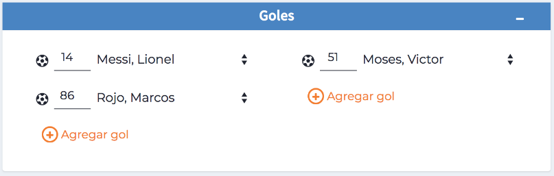

# Carga de resultados de los partidos

Para iniciar la carga de los resultados de los partidos debemos hacer click en <strong>“Editar”</strong>. El mismo nos llevará a la pantalla en la que cargaremos los datos del partido. 

## Información de Partido

- <strong>Día y horario:</strong> aquí podemos modificar el día y el horario del partido.
- <strong>Cancha:</strong> aquí podemos modificar la cancha donde se juega.

## Presentes

Aquí aparecerán los jugadores aceptados dentro de la lista de buena fe.
Vamos a tildar los jugadores que estuvieron presentes en el partido: titulares y suplentes.
También podremos cargar los números de camiseta informados por los jugadores.

## Goles

Para cargar los goles hacemos click en <strong>“Nuevo gol”</strong> y los datos a completar van a ser: minuto y jugador.

## Tarjetas

Para cargar las tarjetas hacemos click en <strong>“Nueva tarjeta”</strong> y los datos a completar van a ser: minuto, tarjeta (amarilla o roja) y jugador.
En caso de que un jugador tenga doble amarillo, cargar las dos amarillas y al guardar el sistema le asignará la roja.

## Suspensiones

En caso de haber un jugador expulsado o suspendido por otro motivo lo cargaremos en este apartado.
Para administrar las suspensiones ver el punto 10 del instructivo “Gestión de suspensiones”

## Walkover y Penales

- <strong>Walkover:</strong> en el caso en que un Equipo no se presente lo podremos cargar en este apartado dando por perdido el partido por 3 goles.
- <strong>Agregar penales:</strong> en el caso de que los partidos se definan por penales, los agregaremos al final de la página.

## Guardar cambios y Cerrar partido

- <strong>Guardar cambios:</strong> una vez que hayamos completado o modificado los datos del partido procederemos a guardar los cambios realizados.
- <strong>Cerrar partido:</strong> luego de haber guardado los cambios procederemos a cerrar el partido para que impacte en las tablas (posiciones, goleadores, tarjetas). Siempre existe la posibilidad de volver a abrir el partido para hacer cualquier corrección. Esta opción está  habilitada únicamente para los Dueños.