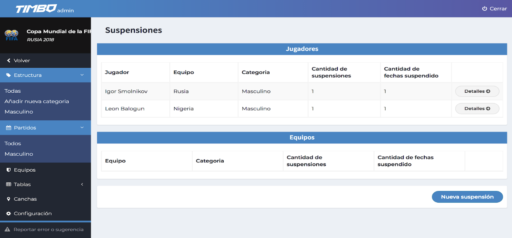
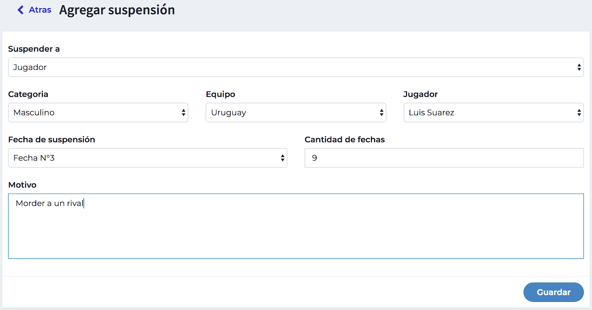

# Gestión de suspensiones

En esta sección vamos a llevar las suspensiones efectuadas a los jugadores y equipos.

- <strong>Jugadores:</strong> en este listado se muestran los jugadores que recibieron suspensiones cargadas en los partidos, como así también las suspensiones agregadas por motivos ajenos a un partido.
- <strong>Equipos:</strong> en este listado se muestran los equipos suspendidos por diferentes motivos.

## Nueva suspensión

En la opción “Nueva suspensión” podremos agregar suspensiones a jugadores y equipos completando los siguientes campos.

