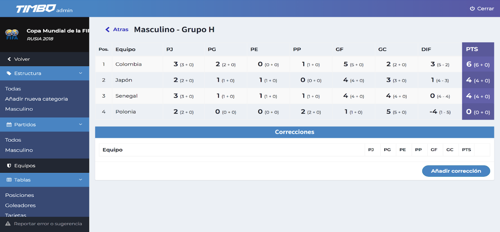
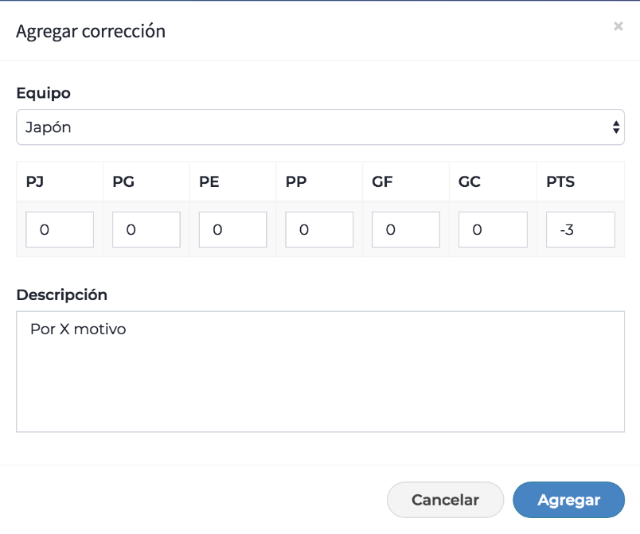
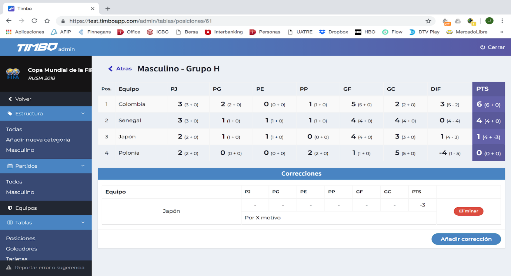

# Correcciones de tablas

Dentro del apartado de Tablas podremos realizar correcciones y modificaciones a las diferentes partes componentes de las tablas de posiciones. 

Dentro de la tabla de cada grupo o zona el botón <strong>“Añadir corrección”</strong> nos llevará al siguiente cuadro.

En el mismo seleccionaremos el equipo al cual vamos a hacer alguna corrección y sumamos o restamos el componente deseado. Por ejemplo si queremos descontar puntos a un equipo por alguna sanción que haya recibido. 

En caso de sumar o restar PG o PE el mismo afectar a los puntos de acuerdo a como haya sido esa corrección: si se resta un PG se restarán tres puntos; si se suma un PE se sumará un punto.

